# SOM UF3 RA1AA2. Configuració dual boot

En aquesta guia veurem com configurar un sistema dual boot amb Ubuntu 20.04 i Fedora 33. Partim d'un sistema amb Ubuntu Desktop ja instal·lat.

## Instal·lació Fedora 33

El primer que cal fer, amb la màquina virtual apagada, és connectar la ISO de Fedora a la unitat òptica de la màquina virtual. Això ho podem fer des de la configuració de la màquina virtual.

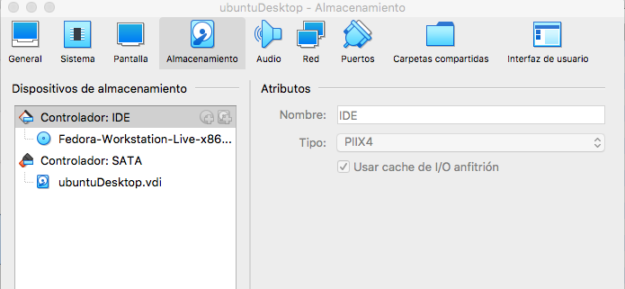

Arranquem de nou la màquina i seleccionem la opció de *Start Fedora-Workstation-Live 33*.

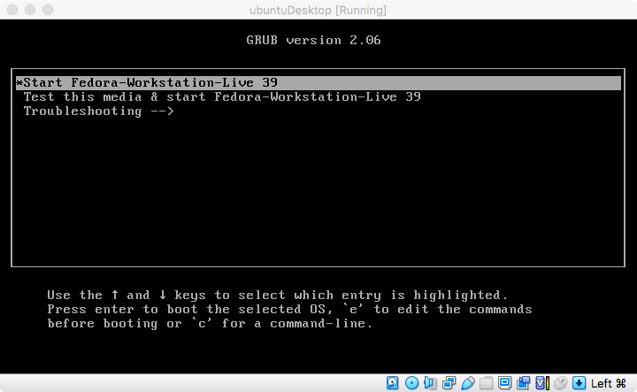

Dins la sessió gràfica, triem l'opció de Instal·lar Fedora.

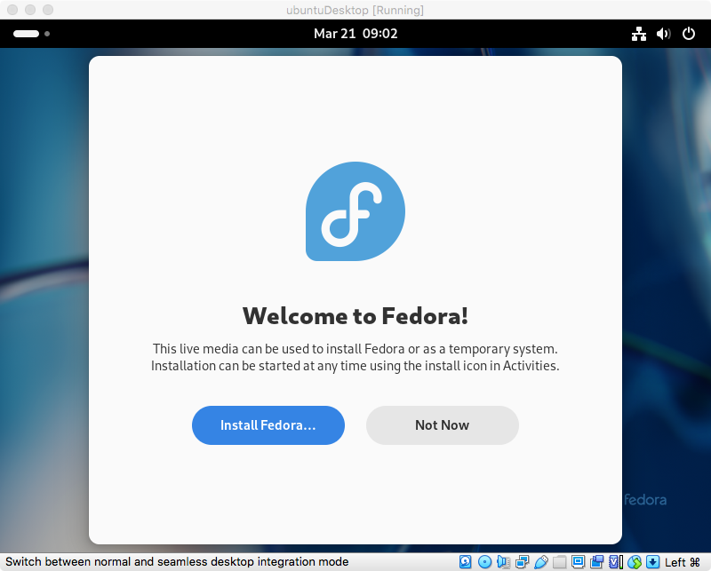

Seleccionem l'idioma i el teclat

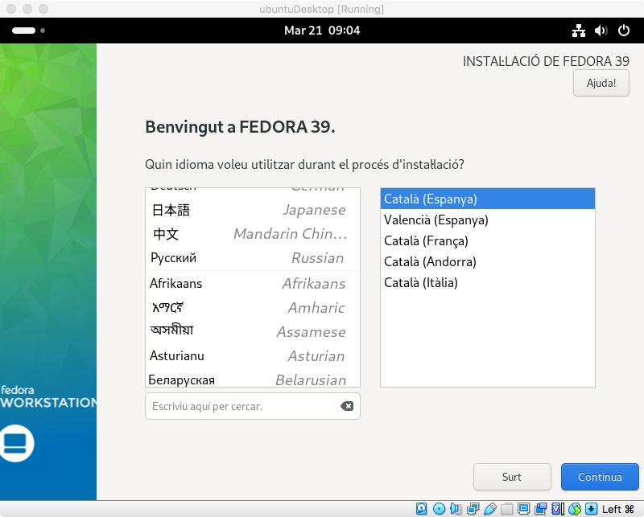

A l'arribar a *resum de la instal·lació*, veiem que marca la icona del disc, indicant que s'ha de seleccionar la unitat per la instal·lació.

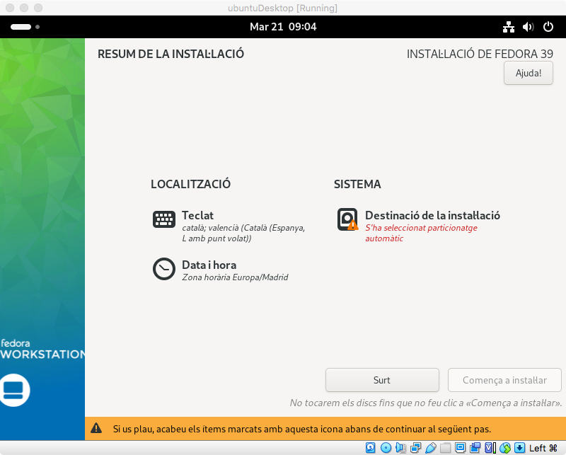

A dins del menú de selecció de disc, seleccionem el disc `Disc estàndards locals`, de fet, només ens ha d'aparèixer un.

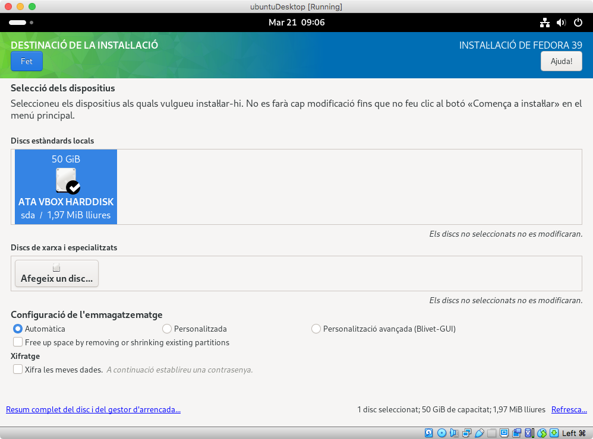

Com el disc ja està particionat i utilitzat per Ubuntu, ens surt una finestra emergent indicant que si volem seguir instal·lant cal agafar una part del disc -> `Reclamar espai lliure`.

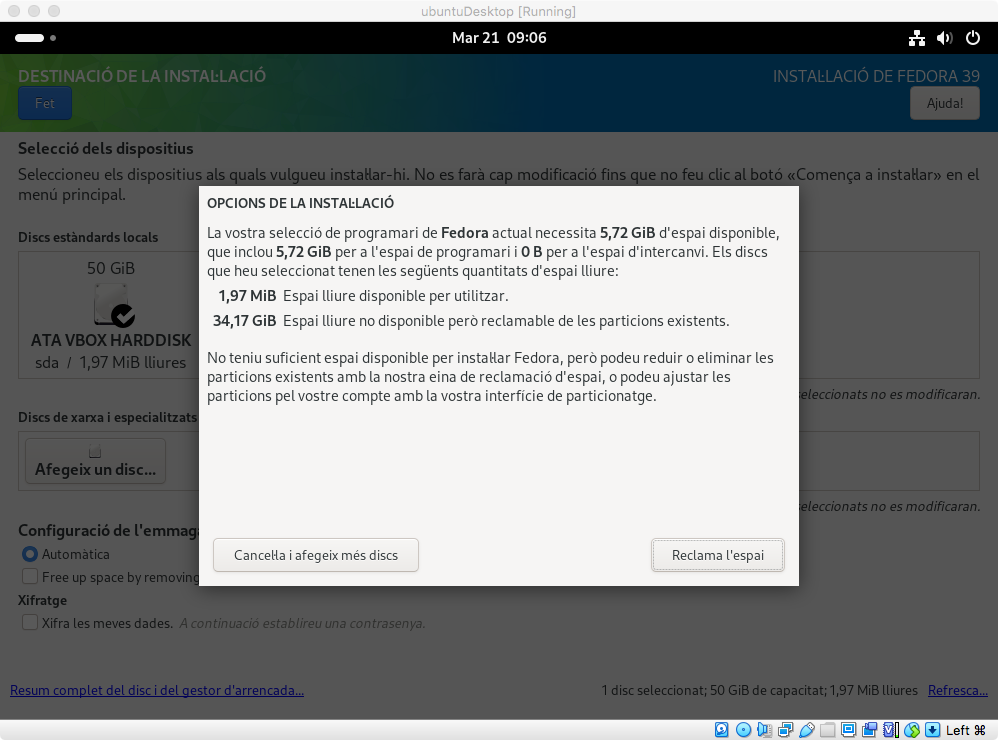

Per fer-ho, seleccionem la partició de l'Ubuntu, és la més gran, i li donem a `Encongeix` per indicar que li volem reduir la mida, per crear espai per la partició de Fedora.

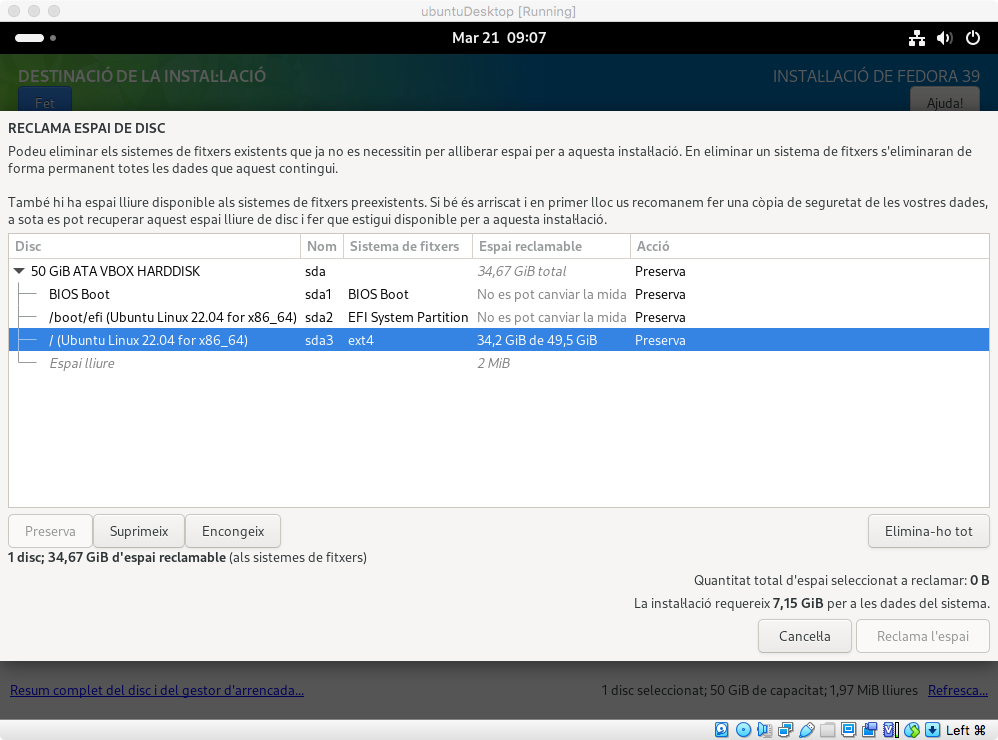

Movem cap l'esquerra la barra per reduir la mida de la partició i un cop tenim espai suficient, li donem a `Reclamar espai`.

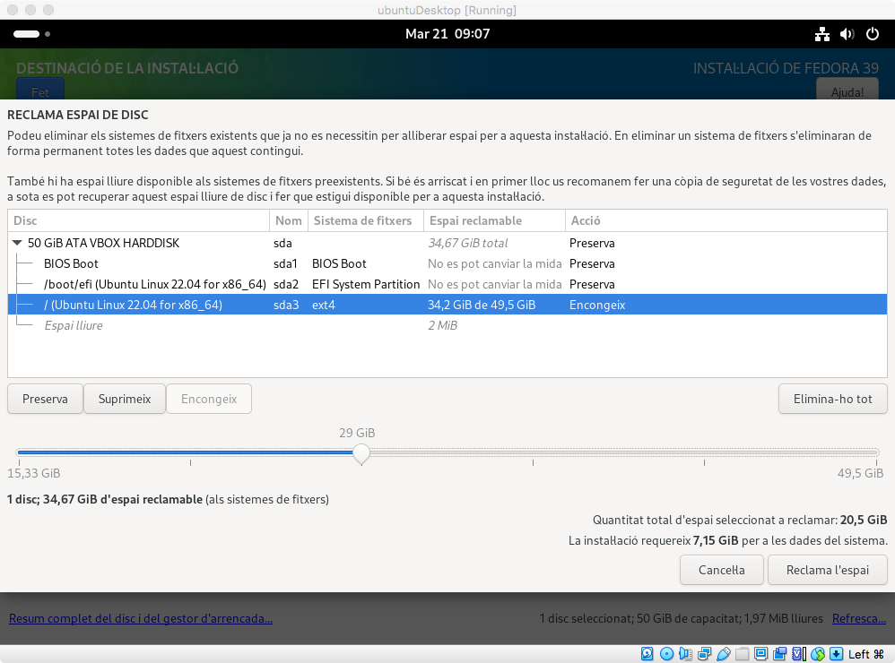

Arribats aquí, ja podem procedir a fer la instal·lació de Fedora.

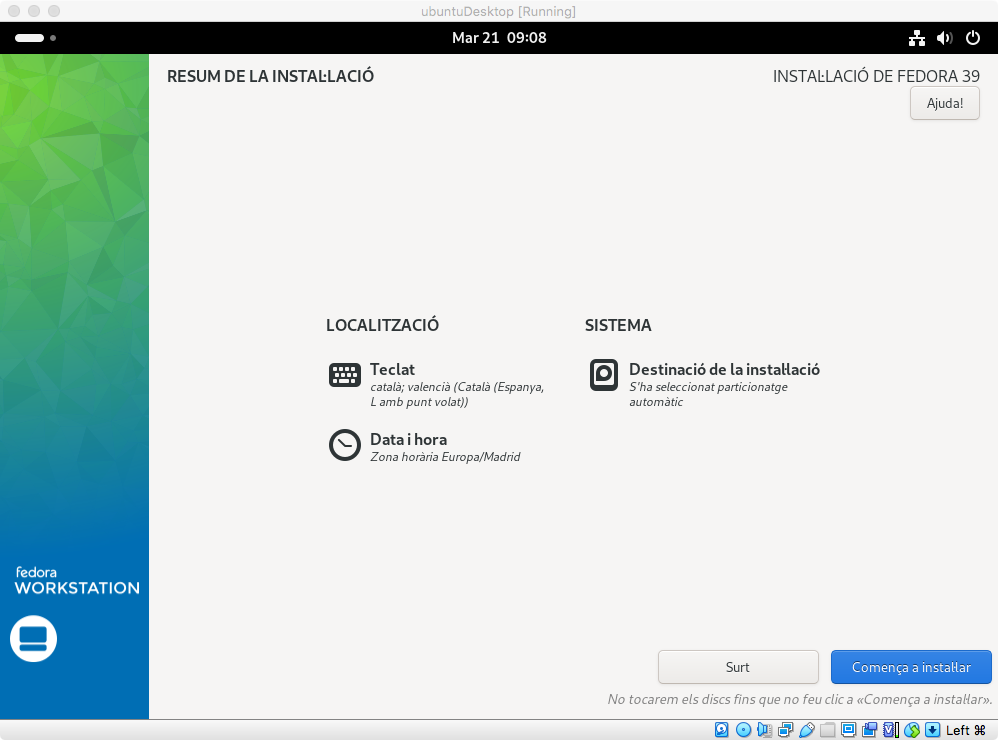

En acabar el procés, ens apareix un missatge indicant que s'ha finalitzat la instal·lació.

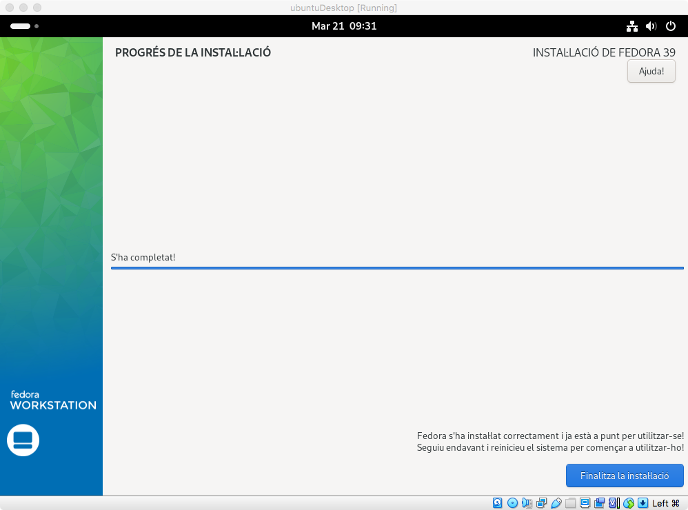

**És molt important quan reinicia el sistema, assegurar-se que s'ha desconnectat la ISO de Fedora, perquè sinó tornarà a arrancar des de la ISO.** Ho podem comprovar perquè el símbol de la unitat òptica a la barra de sota de la màquina virtual ha de sortir ombrejada.

Si ho feu així, us apareix el menú de GRUB amb les dues opcions d'arrancar amb Ubuntu o Fedora.

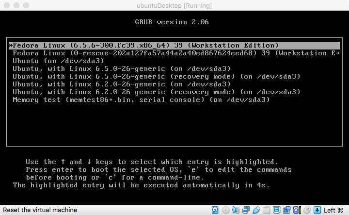

## Configuració GRUB

Arranquem amb Fedora per tal de configurar el GRUB amb l'eina `GRUB customizer`, que és una alternativa més senzilla que editar les configuracions del GRUB manualment.

Per instal·lar l'eina, el primer, és afegir l'origen on es troba el paquet d'instal·lació als orígens que utilitza Ubuntu, per fer-ho, obrirem una terminal i executarem la següent comanda:

```bash
sudo dnf install grub-customizer
```

Un cop instal·lat, ja podem obrir l'eina . Al clicar, us demanarà la contrasenya d'usuari per obrir l'eina perquè necessita privilegis administrador.

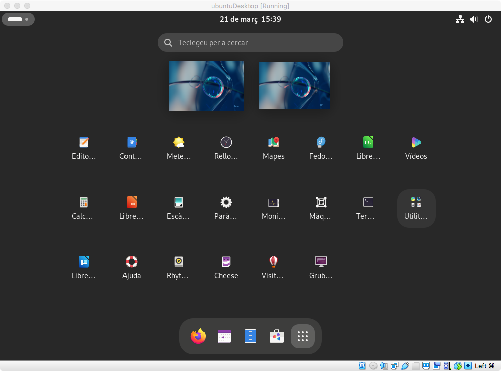

Dins l'eina, podem veure les opcions de configuració del GRUB, com ara l'ordre de les opcions, el temps que està visible, etc.

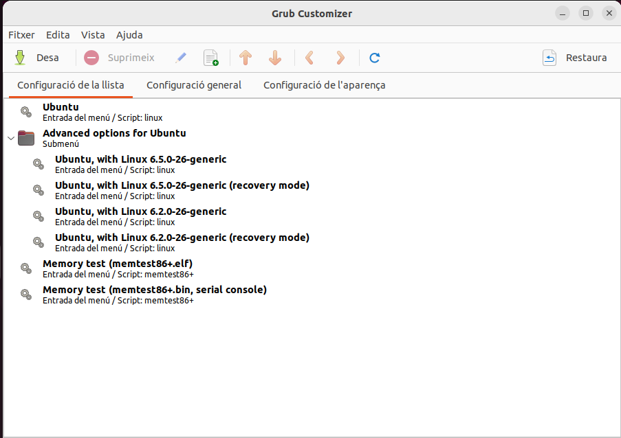

A la pestanya de `Configuració general`, podem veure les opcions que tenim per defecte i seleccionar quina volem que sigui la predeterminada, el temps que volem que estigui visible el menú, etc.

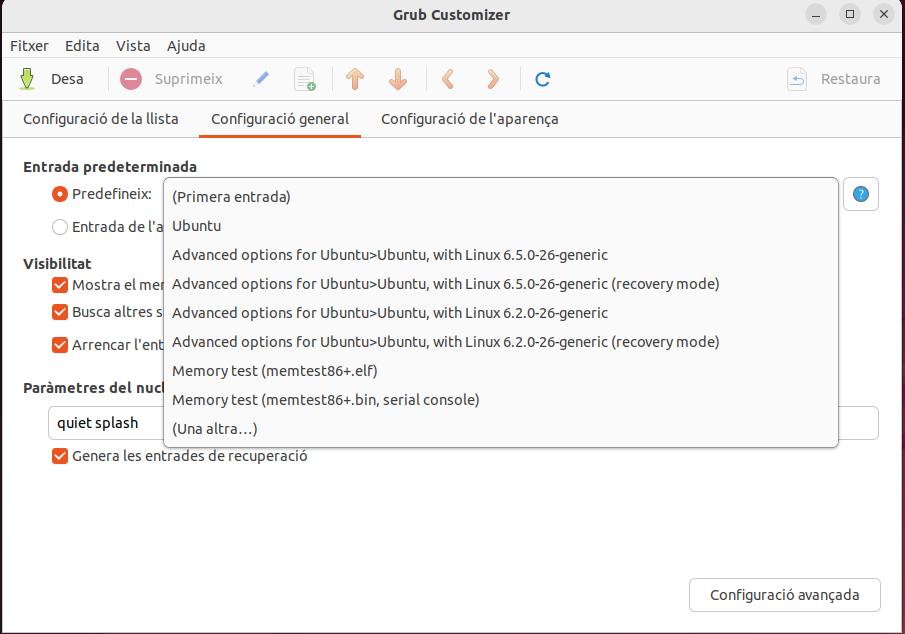

A la pestanya de `Configuració de l'aparença` podem canviar el fons de pantalla, la font, el color, resolució de la pantalla, etc.

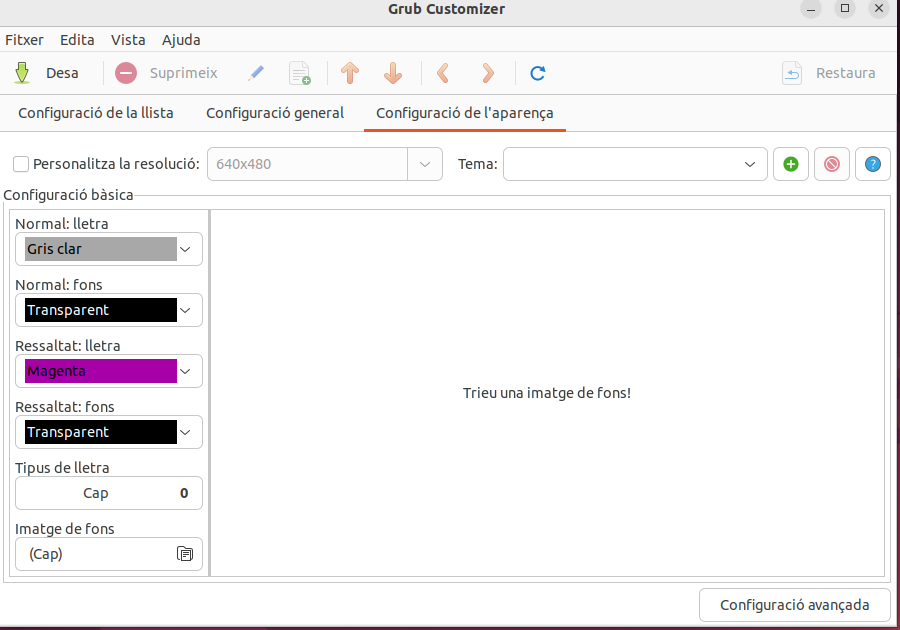

Un cop feta la configuració, ja podem guardar-la i sortir de l'eina. És molt important no tancar l'aplicació fins que no hagi acabat de guardar la configuració, sinó no es guardarà.

Si ara reiniciem, ens apareixeirà el menú de GRUB amb la configuració que hem fet.
